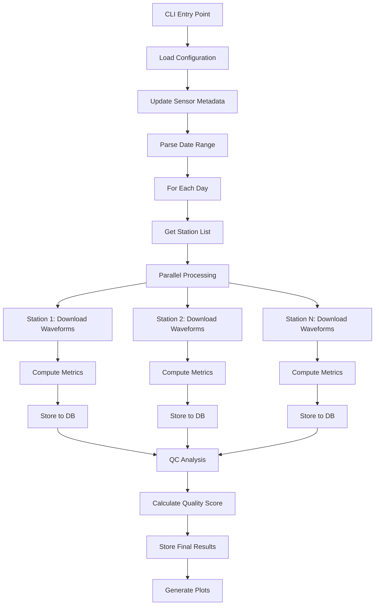

# SQES - Seismic Quality Evaluation System

**Version:** 3.0.0

A Python-based automated system for evaluating seismic data quality from seismometer networks. SQES processes waveform data, computes quality metrics, and generates comprehensive quality reports with scores and visualizations.

---

## 📋 Table of Contents

- [Overview](#overview)
- [Features](#features)
- [Architecture](#architecture)
- [Installation](#installation)
- [Configuration](#configuration)
- [Usage](#usage)
- [Quality Metrics](#quality-metrics)
- [Output](#output)
- [Development](#development)

---

## 🎯 Overview

SQES automates the quality control process for seismic station networks by:

- **Downloading** waveform data from FDSN servers or local SDS archives
- **Computing** comprehensive quality metrics (noise, gaps, spikes, availability)
- **Analyzing** Power Spectral Density (PSD) against Peterson noise models (NHNM/NLNM)
- **Scoring** stations with weighted quality grades (0-100%)
- **Classifying** data quality as: **Baik** (Good), **Cukup Baik** (Fair), **Buruk** (Poor), or **Mati** (Dead)
- **Storing** results in PostgreSQL or MySQL databases
- **Generating** visualization plots and reports

This system is designed for seismology networks that need continuous, automated quality monitoring of their stations.

---

## ✨ Features

### Core Capabilities

- ✅ **Multi-source data ingestion**: FDSN web services or local SDS archives
- ✅ **Parallel processing**: Multi-core support for processing multiple stations simultaneously
- ✅ **Comprehensive QC metrics**: 
  - RMS (Root Mean Square)
  - Amplitude ratios
  - Data availability percentage
  - Gap and overlap detection
  - Spike detection (fast NumPy or memory-efficient Pandas methods)
  - Noise level analysis (PPSD)
  - Dead channel detection (GSN method)
- ✅ **Database storage**: PostgreSQL or MySQL support with connection pooling
- ✅ **Flexible date processing**: Single day or date range processing
- ✅ **Station filtering**: Process all stations or specific subsets
- ✅ **Automated sensor metadata updates**: Scrape sensor information from web sources
- ✅ **Health checks**: Configuration and connection validation

### Output Options

- 📊 **PPSD matrices** saved as `.npz` files (optional)
- 📈 **PDF plots** of power spectral density
- 📉 **Signal plots** for visual inspection
- 💾 **MiniSEED files** of downloaded waveforms (optional)
- 🗄️ **Database records** for historical analysis and trending

---

## 🏗️ Architecture

```
sqes_backend/
├── sqes_cli.py              # Main CLI entry point
├── sqes/
│   ├── __init__.py          # Package version
│   ├── workflows/           # Processing workflow orchestration
│   │   ├── __init__.py      # Public API exports
│   │   ├── orchestrator.py  # Main workflow entry point
│   │   ├── daily_processor.py # Single-day processing logic
│   │   └── helpers.py       # Helper functions
│   ├── analysis/            # QC analysis and scoring
│   │   ├── qc_analyzer.py   # Quality score calculation
│   │   └── station_processor.py # Station data processing
│   ├── core/                # Core computation modules
│   │   ├── basic_metrics.py # RMS, gaps, spikes, availability
│   │   ├── ppsd_metrics.py  # PPSD and noise model analysis
│   │   ├── models.py        # Peterson NHNM/NLNM models
│   │   └── utils.py         # Utility functions
│   ├── clients/             # Data source clients (FDSN, SDS)
│   └── services/            # Infrastructure services
│       ├── config_loader.py # Configuration management
│       ├── db_pool.py       # Database connection pooling
│       ├── repository.py    # Database CRUD operations
│       ├── logging_config.py# Logging setup
│       ├── sensor_updater.py# Sensor metadata updates
│       ├── health_check.py  # System health validation
│       └── file_system.py   # File system operations
├── config/
│   └── config.ini           # Main configuration file
├── logs/                    # Application logs
├── files/                   # Output files (PSD, plots, etc.)
└── tests/                   # Unit tests
```

### Processing Flow



---

## 🚀 Installation

### Prerequisites

- **Python**: 3.10
- **Conda** (recommended)
- **Database**: PostgreSQL or MySQL server

### Using Conda (Recommended)

```bash
# Clone the repository
git clone https://github.com/putuhendrawd/sqes_backend.git
cd sqes_backend

# Create conda environment
conda env create -f environment.yml

# Activate environment
conda activate sqes_backend
```

### Database Setup

**PostgreSQL:**
```sql
CREATE DATABASE your_db_name;
CREATE USER your_db_user WITH PASSWORD 'your_password';
GRANT ALL PRIVILEGES ON DATABASE your_db_name TO your_db_user;
```

**MySQL:**
```sql
CREATE DATABASE your_db_name;
CREATE USER 'your_db_user'@'localhost' IDENTIFIED BY 'your_password';
GRANT ALL PRIVILEGES ON your_db_name.* TO 'your_db_user'@'localhost';
```

---

## ⚙️ Configuration

### Main Configuration File

Copy the sample configuration and edit it:

```bash
cp config/sample_config.ini config/config.ini
nano config/config.ini
```

### Configuration Sections

#### `[basic]` - Core Settings

```ini
[basic]
# Database selection
use_database = postgresql  # or 'mysql'

# Waveform data source
waveform_source = fdsn     # or 'sds' for local archives
archive_path = /path/to/sds/archive  # Only if waveform_source = sds

# Inventory source
inventory_source = fdsn    # or 'local'
inventory_path = /path/to/inventory/folder  # Only if inventory_source = local

# Output directories
outputpsd = /opt/sqes_output/psd_npz
outputpdf = /opt/sqes_output/pdf_plots
outputsignal = /opt/sqes_output/signal_plots
outputmseed = /opt/sqes_output/mseed_files

# Performance
cpu_number_used = 16       # Number of parallel processes
spike_method = fast        # 'fast' (NumPy) or 'efficient' (Pandas)

# Sensor metadata URL
sensor_update_url = http://your.web.source/{station_code}
```

#### `[client]` - FDSN Settings

```ini
[client]
url = http://your-fdsn-server.com
user = your_username
password = your_password
```

#### `[postgresql]` or `[mysql]` - Database Credentials

```ini
[postgresql]
db_type = postgresql
host = 127.0.0.1
port = 5432
database = your_db_name
user = your_db_user
password = your_db_password
pool_size = 32
```

---

## 📖 Usage

### Basic Commands

```bash
# Make the CLI executable
chmod +x sqes_cli.py

# Process a single day (all stations)
./sqes_cli.py --date 20230101

# Process a date range
./sqes_cli.py --date-range 20230101 20230107

# Process specific stations
./sqes_cli.py --date 20230101 -s BBJI GSI TNTI

# Process with verbose logging
./sqes_cli.py --date 20230101 -v      # INFO level
./sqes_cli.py --date 20230101 -vv     # DEBUG level

# Save additional outputs
./sqes_cli.py --date 20230101 --ppsd --mseed

# Update sensor metadata only (no data processing)
./sqes_cli.py --sensor-update

# Flush existing data before processing
./sqes_cli.py --date 20230101 --flush

# Apply sensor metadata update
./sqes_cli.py --date 20230101 --sensor-update

# Check configuration and connections
./sqes_cli.py --check-config
```

### Command-Line Options

| Option | Description |
|--------|-------------|
| `-d, --date YYYYMMDD` | Process a single date |
| `-r, --date-range START END` | Process a date range (inclusive) |
| `-s, --station STA [STA ...]` | Process specific station codes |
| `--ppsd` | Save PPSD matrices as `.npz` files |
| `--mseed` | Save downloaded waveforms as MiniSEED |
| `-f, --flush` | Flush existing data (only with `--date`) |
| `-v, --verbose` | Increase logging verbosity (`-v` = INFO, `-vv` = DEBUG) |
| `--sensor-update` | Perform automatic sensor metadata update |
| `--check-config` | Validate configuration and test connections |
| `--version` | Show version and exit |

### Examples

**Daily processing with INFO logging:**
```bash
./sqes_cli.py --date 20231215 -v
```

**Process multiple stations for a week:**
```bash
./sqes_cli.py --date-range 20231201 20231207 -s BBJI GSI TNTI LUWI -v
```

**Full processing with all outputs:**
```bash
./sqes_cli.py --date 20231215 --ppsd --mseed -vv
```

**Reprocess a day (flush old data first):**
```bash
./sqes_cli.py --date 20231215 --flush -v
```

**Process with sensor metadata update:**
```bash
./sqes_cli.py --date 20231215 --sensor-update -v
```

**Save waveforms and PPSD matrices:**
```bash
./sqes_cli.py --date 20231215 --mseed --ppsd -v
```

**Update sensor metadata only (no processing):**
```bash
./sqes_cli.py --sensor-update
```

---

## 📊 Quality Metrics

SQES computes a weighted quality score (0-100%) based on the following metrics:

### Metric Components

| Metric | Weight | Description |
|--------|--------|-------------|
| **Availability** | 15% | Percentage of expected data present |
| **RMS** | 15% | Root Mean Square amplitude (sensor health) |
| **Amplitude Ratio** | 10% | Ratio between max and min amplitudes |
| **Gaps** | 2.5% | Number of data gaps |
| **Overlaps** | 2.5% | Number of data overlaps |
| **Noise Level** | 30% | Percentage within Peterson noise models |
| **Dead Channel Linear** | 12.5% | Linear dead channel detection |
| **Dead Channel GSN** | 12.5% | GSN dead channel detection |

### Quality Classification

| Score | Classification | Indonesian |
|-------|----------------|------------|
| 90-100% | Good | Baik |
| 60-89% | Fair | Cukup Baik |
| 1-59% | Poor | Buruk |
| 0% | Dead | Mati |

### Grading Logic

Each metric is graded using the `_agregate()` function:

```python
grade = 100.0 - (15.0 * (parameter - limit) / margin)
```

- Parameters exceeding limits reduce the grade
- Final score is a weighted average across all components (E, N, Z)

---

## 📁 Output

### Database Tables

**`stations_qc_details`** - Raw quality metrics per component:
- Station code, date, component (E/N/Z)
- RMS, amplitude ratio, availability
- Gap/overlap counts, spike counts
- Noise percentages, DC levels

**`stations_data_quality`** - Final quality scores:
- Station code, date
- Quality score (0-100%)
- Classification (Baik/Cukup Baik/Buruk/Mati)
- Notes/warnings

**`stations_sensor`** - Station metadata:
- Network, station code, sensor type
- Location information

### File Outputs

**PPSD NPZ files** (`--ppsd`):
```
/opt/sqes_output/psd_npz/2023/20231215/BBJI_BHE_20231215.npz
```

**PDF Plots** (auto-generated):
```
/opt/sqes_output/pdf_plots/2023/20231215/BBJI_BHE_psd.pdf
```

**Signal Plots** (auto-generated):
```
/opt/sqes_output/signal_plots/2023/20231215/BBJI_BHE_signal.png
```

**MiniSEED Files** (`--mseed`):
```
/opt/sqes_output/mseed_files/2023/20231215/BBJI_BHE.mseed
```

### Logs

Logs are stored in `logs/` directory:
```
logs/sqes_20231215.log
logs/sqes_20231215_debug.log  # If -vv is used
```

---

## 🔧 Development

### Project Structure

- **`sqes_cli.py`**: CLI argument parsing and main entry point
- **`sqes/workflows/orchestrator.py`**: Main workflow orchestration for date ranges
- **`sqes/workflows/daily_processor.py`**: Single-day processing logic
- **`sqes/workflows/helpers.py`**: Helper functions for setup and configuration
- **`sqes/analysis/station_processor.py`**: Downloads waveforms and computes metrics
- **`sqes/analysis/qc_analyzer.py`**: Calculates quality scores
- **`sqes/services/repository.py`**: Database CRUD operations
- **`sqes/services/file_system.py`**: File system operations
- **`sqes/core/basic_metrics.py`**: RMS, gaps, spikes, availability
- **`sqes/core/ppsd_metrics.py`**: PPSD and noise model calculations
- **`sqes/core/models.py`**: Peterson NHNM/NLNM noise models
- **`sqes/core/utils.py`**: Utility functions

### Running Tests

```bash
# Run all tests
pytest tests/

# Run with coverage
pytest --cov=sqes tests/

# Run specific test file
pytest tests/test_basic_metrics.py
```

### Adding New Metrics

1. Add computation function to `sqes/core/basic_metrics.py` or `ppsd_metrics.py`
2. Update `sqes/analysis/station_processor.py` to compute the metric
3. Modify database schema to store the new metric
4. Update `sqes/analysis/qc_analyzer.py` to include it in scoring
5. Add tests in `tests/`

### Code Style

- Follow PEP 8 conventions
- Use type hints where applicable
- Add docstrings to all functions
- Keep functions focused and modular

---

## 📝 License


---

## 👥 Contributors


---

## 🐛 Troubleshooting

### Common Issues

**Database connection errors:**
```bash
# Check configuration
./sqes_cli.py --check-config

# Verify database is running
psql -h 127.0.0.1 -U your_db_user -d your_db_name
```

**FDSN download failures:**
- Check network connectivity
- Verify FDSN credentials in `config.ini`
- Try with `-vv` for detailed error messages

**Memory issues with spike detection:**
- Use `spike_method = efficient` in config
- Reduce `cpu_number_used` to lower parallel load

**Missing data:**
- Check if station has data for the requested date
- Verify inventory source is correct
- Ensure `--sensor-update` is used if metadata update is needed

---

## 📞 Support 

For issues, questions, or contributions:
- Open an issue on GitHub
- Contact: [putu.hendra@bmkg.go.id]

---

**SQES** - Automated Seismic Quality Evaluation System for Better Data Quality Monitoring
