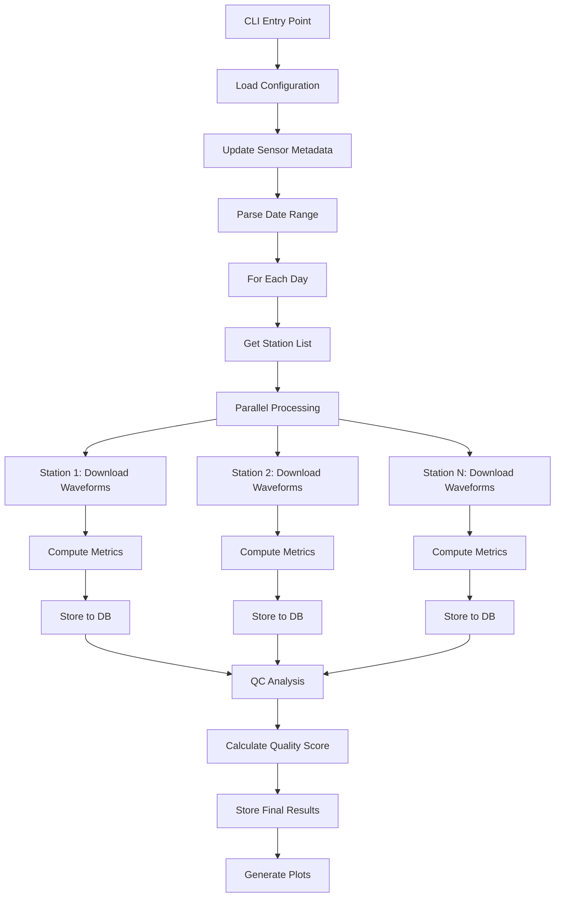

# SQES - Seismic Quality Evaluation System

**Version:** 3.0.0

A Python-based automated system for evaluating seismic data quality from seismometer networks. SQES processes waveform data, computes quality metrics, and generates comprehensive quality reports with scores and visualizations.

---

## 📋 Table of Contents

- [Overview](#-overview)
- [Features](#-features)
- [Architecture](#️-architecture)
- [Installation](#-installation)
- [Configuration](#️-configuration)
- [Usage](#-usage)
- [Quality Metrics](#-quality-metrics)
- [Output](#-output)
- [Development](#-development)

---

## 🎯 Overview

SQES automates the quality control process for seismic station networks by:

- **Downloading** waveform data from FDSN servers or local SDS archives
- **Computing** comprehensive quality metrics (noise, gaps, spikes, availability)
- **Analyzing** Power Spectral Density (PSD) against Peterson noise models (NHNM/NLNM)
- **Scoring** stations with weighted quality grades (0-100%)
- **Classifying** data quality as: **Baik** (Good), **Cukup Baik** (Fair), **Buruk** (Poor), or **Mati** (Dead)
- **Storing** results in PostgreSQL or MySQL databases
- **Generating** visualization plots and reports

This system is designed for seismology networks that need continuous, automated quality monitoring of their stations.

---

## ✨ Features

### Core Capabilities

- ✅ **Multi-source data ingestion**: FDSN web services or local SDS archives
- ✅ **Parallel processing**: Multi-core support for processing multiple stations simultaneously
- ✅ **Comprehensive QC metrics**: 
  - RMS (Root Mean Square)
  - Amplitude ratios
  - Data availability percentage
  - Gap and overlap detection
  - Spike detection (fast NumPy or memory-efficient Pandas methods)
  - Noise level analysis (PPSD)
  - Dead channel detection (GSN method)
- ✅ **Database storage**: PostgreSQL or MySQL support with connection pooling
- ✅ **Flexible date processing**: Single day or date range processing
- ✅ **Station filtering**: Process all stations or specific subsets
- ✅ **Automated station & sensor metadata updates**: Scrape metadata from web sources
- ✅ **Health checks**: Configuration and connection validation

### Output Options

- 📈 **PDF plots** of power spectral density
- 📉 **Signal plots** for visual inspection
- 🗄️ **Database records** for historical analysis and trending
- 📊 **PPSD matrices** saved as `.npz` files (optional)
- 💾 **MiniSEED files** of downloaded waveforms (optional)


---

## 🏗️ Architecture

```
sqes_backend/
├── sqes_cli.py              # Main CLI entry point
├── sqes/
│   ├── __init__.py          # Package version
│   ├── workflows/           # Processing workflow orchestration
│   │   ├── __init__.py      # Public API exports
│   │   ├── orchestrator.py  # Main workflow entry point
│   │   ├── daily_processor.py # Single-day processing logic
│   │   ├── helpers.py       # Helper functions
│   │   └── station_processor.py # Station data processing
│   ├── analysis/            # QC analysis and scoring
│   │   └── qc_analyzer.py   # Quality score calculation
│   ├── core/                # Core computation modules
│   │   ├── basic_metrics.py # RMS, gaps, spikes, availability
│   │   ├── ppsd_metrics.py  # PPSD and noise model analysis
│   │   ├── models.py        # Peterson NHNM/NLNM models
│   │   └── utils.py         # Utility functions
│   ├── clients/             # Data source clients (FDSN, SDS)
│   ├── services/            # Infrastructure services
│   │   ├── config_loader.py # Configuration management
│   │   ├── db_pool.py       # Database connection pooling
│   │   ├── repository.py    # Database CRUD operations (Repository Pattern)
│   │   ├── logging_config.py# Logging setup
│   │   ├── health_check.py  # System health validation
│   │   └── file_system.py   # File system operations
│   └── utils/               # Utility scripts
│       ├── station_updater.py # Station metadata updates
│       └── sensor_updater.py  # Sensor metadata updates
├── config/
│   └── config.ini           # Main configuration file
├── logs/                    # Application logs
├── files/                   # Output files (PSD, plots, etc.)
└── tests/                   # Unit tests
```

### Processing Flow



---

## 🚀 Installation

### Prerequisites

- **Python**: 3.10
- **Conda** (recommended)
- **Database**: PostgreSQL or MySQL server

### Using Conda (Recommended)

```bash
# Clone the repository
git clone https://github.com/putuhendrawd/sqes_backend.git
cd sqes_backend

# Create conda environment
conda env create -f environment.yml

# Activate environment
conda activate sqes_backend
```

### Database Setup

#### PostgreSQL Setup (Recommended)

**Step 1: Create Database and User**

Connect to PostgreSQL as superuser:
```bash
sudo -u postgres psql
```

Create the database and user:
```sql
-- Create database
CREATE DATABASE sqes;

-- Create user with password
CREATE USER sqes_user WITH PASSWORD 'your_secure_password';

-- Grant connection privileges
GRANT ALL PRIVILEGES ON DATABASE sqes TO sqes_user;

-- Exit psql
\q
```

**Step 2: Import Schema**

Import the clean schema into your database:
```bash
psql -U sqes_user -d sqes -f files/sqes_schema_clean.sql
```

> [!NOTE]
> The schema file `sqes_schema_clean.sql` is a portable version without hardcoded ownership. It creates 8 tables:
> - `stations` - Station metadata
> - `stations_sensor` - Sensor information per channel
> - `stations_sensor_latency` - Real-time latency tracking
> - `stations_qc_details` - Detailed QC metrics per component
> - `stations_data_quality` - Overall quality scores
> - `stations_dominant_data_quality` - Most common quality per station
> - `stations_site_quality` - Site quality assessments
> - `stations_visit` - Maintenance visit tracking

**Step 3: Configure Table Permissions**

Connect to your database and grant necessary permissions:
```bash
psql -U postgres -d sqes
```

Grant table permissions to your user:
```sql
-- Grant full access to all tables
GRANT ALL PRIVILEGES ON ALL TABLES IN SCHEMA public TO sqes_user;

-- Grant sequence usage (for auto-increment IDs)
GRANT USAGE, SELECT ON ALL SEQUENCES IN SCHEMA public TO sqes_user;

-- Grant future table permissions (if you plan to add more tables)
ALTER DEFAULT PRIVILEGES IN SCHEMA public 
    GRANT ALL PRIVILEGES ON TABLES TO sqes_user;

ALTER DEFAULT PRIVILEGES IN SCHEMA public 
    GRANT USAGE, SELECT ON SEQUENCES TO sqes_user;

-- Exit psql
\q
```

**Step 4: Verify Installation**

Verify tables were created successfully:
```bash
psql -U sqes_user -d sqes -c "\dt"
```

You should see 8 tables listed. To verify permissions:
```bash
psql -U sqes_user -d sqes -c "SELECT * FROM stations LIMIT 1;"
```

#### Alternative: MySQL Setup

If you prefer MySQL:

```bash
# Connect to MySQL
mysql -u root -p
```

```sql
-- Create database
CREATE DATABASE sqes CHARACTER SET utf8mb4 COLLATE utf8mb4_unicode_ci;

-- Create user
CREATE USER 'sqes_user'@'localhost' IDENTIFIED BY 'your_secure_password';

-- Grant privileges
GRANT ALL PRIVILEGES ON sqes.* TO 'sqes_user'@'localhost';
FLUSH PRIVILEGES;

-- Exit MySQL
EXIT;
```

> [!IMPORTANT]
> MySQL schema is not yet available. Currently, only PostgreSQL schema (`sqes_schema_clean.sql`) is provided. If you need MySQL support, you'll need to adapt the PostgreSQL schema or request MySQL-specific schema creation.

#### Troubleshooting

**Permission denied errors:**
```bash
# Ensure user has proper grants
sudo -u postgres psql -d sqes -c "GRANT ALL PRIVILEGES ON ALL TABLES IN SCHEMA public TO sqes_user;"
```

**Connection refused:**
```bash
# Check if PostgreSQL is running
sudo systemctl status postgresql

# Start PostgreSQL if needed
sudo systemctl start postgresql
```

**Schema import errors:**
```bash
# Check for existing tables (drop if restarting)
psql -U sqes_user -d sqes -c "\dt"

# Drop all tables if you need to restart (WARNING: destroys data)
psql -U postgres -d sqes -c "DROP SCHEMA public CASCADE; CREATE SCHEMA public;"
```

---

## ⚙️ Configuration

### Main Configuration File

Copy the sample configuration and edit it:

```bash
cp config/sample_config.ini config/config.ini
nano config/config.ini
```

### Configuration Sections

#### `[basic]` - Core Settings

```ini
[basic]
# Database selection
use_database = postgresql  # or 'mysql'

# Waveform data source
waveform_source = fdsn     # or 'sds' for local archives
archive_path = /path/to/sds/archive  # Only if waveform_source = sds

# Inventory source
inventory_source = fdsn    # or 'local'
inventory_path = /path/to/inventory/folder  # Only if inventory_source = local

# Output directories
outputpsd = /your/directory/path/sqes_output/psd_npz
outputpdf = /your/directory/path/sqes_output/pdf_plots
outputsignal = /your/directory/path/sqes_output/signal_plots
outputmseed = /your/directory/path/sqes_output/mseed_files

# Performance
cpu_number_used = 16       # Number of parallel processes
spike_method = fast        # 'fast' (NumPy) or 'efficient' (Pandas)

# Sensor metadata URL
sensor_update_url = http://your.web.source/{station_code}
```

#### `[client]` - FDSN Settings

```ini
[client]
url = http://your-fdsn-server.com
user = your_username
password = your_password
```

#### `[postgresql]` or `[mysql]` - Database Credentials

```ini
[postgresql]
db_type = postgresql
host = 127.0.0.1
port = 5432
database = your_db_name
user = your_db_user
password = your_db_password
pool_size = 32
```

---

## 📖 Usage

### Basic Commands

```bash
# Make the CLI executable
chmod +x sqes_cli.py
```

### Command-Line Options

| Option | Description |
|--------|-------------|
| `-d, --date YYYYMMDD` | Process a single date |
| `-r, --date-range START END` | Process a date range (inclusive) |
| `-s, --station STA [STA ...]` | Process specific station codes |
| `-n, --network NET [NET ...]` | Process specific network codes |
| `--ppsd` | Save PPSD matrices as `.npz` files |
| `--mseed` | Save downloaded waveforms as MiniSEED |
| `-f, --flush` | Flush existing data (only with `--date`) |
| `-v, --verbose` | Increase logging verbosity (`-v` = INFO, `-vv` = DEBUG) |
| `--station-update` | Perform automatic station metadata update (triggers sensor update) |
| `--sensor-update` | Perform automatic sensor metadata update |
| `--check-config` | Validate configuration and test connections |
| `--version` | Show version and exit |

### Examples

**Daily processing with INFO logging:**
```bash
./sqes_cli.py --date 20231215 -v
```

**Process multiple stations for a week:**
```bash
./sqes_cli.py --date-range 20231201 20231207 -s BBJI GSI TNTI LUWI -v
```

**Process specific network:**
```bash
./sqes_cli.py --date 20231215 --network IA -v
```

**Process multiple networks:**
```bash
./sqes_cli.py --date 20231215 --network IA II -v
```

**Process specific stations filtering by network:**
```bash
./sqes_cli.py --date 20231215 -s BBJI GSI --network IA -v
```

**Full processing with all outputs:**
```bash
./sqes_cli.py --date 20231215 --ppsd --mseed -vv
```

**Reprocess a day (flush old data first):**
```bash
./sqes_cli.py --date 20231215 --flush -v
```

**Process with station and sensor metadata update:**
```bash
./sqes_cli.py --date 20231215 --station-update -v
# Automatically runs sensor update after station update
```


**Save waveforms and PPSD matrices:**
```bash
./sqes_cli.py --date 20231215 --mseed --ppsd -v
```

**Update station metadata (and automatically sensor metadata):**
```bash
./sqes_cli.py --station-update
```

**Update sensor metadata only (no processing):**
```bash
./sqes_cli.py --sensor-update
```

### Automated Daily Processing

For production deployments, you can automate daily processing using a cron job. The included `scripts/daily_run.sh` script automatically processes the previous day's data (UTC).

#### Features

- Automatically processes "yesterday's" data at a scheduled time
- Auto-detects project directory and Python environment
- Logs application output to `logs/log/YYYYMMDD.log`
- Logs cron errors to `logs/error/cron_YYYYMMDD.err`
- Includes sensor metadata updates

#### Setup Cron Job

1. **Make the script executable** (if not already):
   ```bash
   chmod +x scripts/daily_run.sh
   ```

2. **Edit your crontab**:
   ```bash
   crontab -e
   ```

3. **Add the following line** to run daily at 00:00 UTC:
   ```bash
   0 0 * * * /your/directory/path/sqes_backend/scripts/daily_run.sh
   ```
   
   Or, if you want to run at 02:00 UTC:
   ```bash
   0 2 * * * /your/directory/path/sqes_backend/scripts/daily_run.sh
   ```

4. **Save and exit** the editor (in nano: `Ctrl+O`, `Enter`, `Ctrl+X`)

#### Verify Cron Job

Check that your cron job is installed:
```bash
crontab -l
```

#### Monitoring

- **Application logs**: `logs/log/YYYYMMDD.log` - Contains all processing details
- **Cron errors**: `logs/error/cron_YYYYMMDD.err` - Only contains startup/shell errors
- **Check last run**: `ls -lt logs/log/ | head` - Shows most recent log files


---

## 📊 Quality Metrics

SQES computes a weighted quality score (0-100%) based on the following metrics:

### Metric Components

Quality thresholds are based on **Ringler et al. (2015)** 90th percentile standards and **QuARG** (Quality Assurance Review Group) guidelines for seismic network quality control.

| Metric | Weight | Description | Thresholds |
|--------|--------|-------------|------------|
| **Noise Level** | 35% | Percentage of PSD within Peterson noise models (NHNM/NLNM) | Calculated as `100% - pct_above - pct_below` |
| **Availability** | 15% | Percentage of expected data present | N/A (direct percentage) |
| **RMS** | 10% | Root Mean Square amplitude (sensor health indicator) | Limit: 5000, Margin: 7500 |
| **Amplitude Ratio** | 10% | Ratio between max and min amplitudes | Limit: 1.01, Margin: 2.02 |
| **Gaps** | 10% | Number of data gaps | Limit: 0.00274, Margin: 0.992 (QuARG) |
| **Overlaps** | 10% | Number of data overlaps | Limit: 0, Margin: 1.25 |
| **Spikes** | 10% | Number of detected amplitude spikes | Limit: 0, Margin: 25 |

> [!NOTE]
> Dead Channel Linear (DCL) and Dead Channel GSN (DCG) are computed but used as **binary flags** for sensor malfunction detection, not included in the weighted score calculation.
> 
> **DCL threshold**: ≤ 2.25 indicates unresponsive sensor 
> **DCG threshold**: = 1 indicates dead channel (binary flag)

### Quality Classification

| Score | Classification | Indonesian | Notes |
|-------|----------------|------------|-------|
| 90-100% | Good | Baik | All components healthy |
| 60-89% | Fair | Cukup Baik | Acceptable quality |
| 1-59% | Poor | Buruk | Degraded performance |
| 0% | Dead | Mati | No data available |

> [!IMPORTANT]
> If any component is **unresponsive or damaged** (score = 1.0), the final station score is **capped at 59%** (maximum "Poor" grade) regardless of other component scores.

### Grading Logic

**Step 1: Individual Metric Grading**

Each metric is graded using the `_agregate()` function:

```python
grade = 100.0 - (15.0 * (parameter - limit) / margin)
# Clamped between 0-100%
```

Parameters exceeding limits reduce the grade. The function ensures scores stay within valid bounds.

**Step 2: Component Score Calculation**

For each component (E, N, Z), the algorithm first checks for critical failures, then computes a weighted score with additional availability-based adjustments:

```python
# Special cases (override weighted calculation):
if availability <= 0.0:
    component_score = 0.0  # Dead sensor
elif dcg == 1 or dcl <= 2.25:
    component_score = 1.0  # Unresponsive to vibration (QuARG)
elif 0 < rms < 1:
    component_score = 1.0  # Damaged sensor
else:
    # Normal weighted calculation
    component_score = (0.35 * noise_level + 
                       0.15 * availability + 
                       0.10 * rms_grade + 
                       0.10 * amplitude_ratio + 
                       0.10 * gaps + 
                       0.10 * overlaps + 
                       0.10 * spikes)
    
    # Availability-based score capping
    if 50 <= availability < 97:
        component_score = max(component_score, 89.0)  # Cap at "Fair" max
    elif 0 < availability < 50:
        component_score = max(component_score, 59.0)  # Cap at "Poor" max
```

**Step 3: Station Score Aggregation**

The final station score is the **25th percentile** of all component scores, with special handling for degraded components:

```python
if any component has score == 1.0:  # Unresponsive/damaged component
    station_score = min(np.percentile([score_E, score_N, score_Z], 25), 59.0)
else:
    station_score = np.percentile([score_E, score_N, score_Z], 25)
```

> [!NOTE]
> **Why 25th percentile?**  
> Using the 25th percentile (lower quartile) ensures that the station score reflects the quality of the worst-performing component more prominently. This conservative approach aligns with quality control best practices: a station is only as good as its weakest component. The 25th percentile is more sensitive to individual component failures while still considering overall station health.

### Quality Warnings

The system automatically generates warnings for all conditions that match the QC criteria. Multiple warnings can be reported for a single component if it has multiple issues.

| Warning Type | Condition | Warning Message (Indonesian) |
|--------------|-----------|------------------------------|
| **Critical** | `availability <= 0%` | "Komponen {X} Mati" - Component dead |
| **Critical** | `dcg == 1 OR dcl <= 2.25` | "Komponen {X} tidak merespon getaran" - No response to vibration |
| **Critical** | `0 < rms < 1` | "Komponen {X} Rusak" - Component damaged |
| **Quality** | `pct_below > 20%` | "Cek metadata komponen {X}" - Check component metadata |
| **Quality** | `gaps > 5` | "Terlalu banyak gap pada komponen {X}" - Too many gaps |
| **Quality** | `overlaps > 5` | "Terlalu banyak overlap pada komponen {X}" - Too many overlaps |
| **Quality** | `pct_above > 20% AND avail >= 10%` | "Noise tinggi di komponen {X}" - High noise |
| **Quality** | `num_spikes > 25` | "Spike berlebihan pada komponen {X}" - Excessive spikes |
| **Availability** | `80 <= availability < 97%` | "Availability rendah pada komponen {X}" - Low availability |
| **Availability** | `0 < availability < 80%` | "Availability sangat rendah pada komponen {X}" - Very low availability |

> [!NOTE]
> All warning conditions are checked independently. A component can receive multiple warnings if it meets multiple criteria (e.g., both high gaps and high spikes). Critical warnings (dead, unresponsive, damaged) are handled separately with fixed scores before quality metric warnings are evaluated.

---

## 📁 Output

### Database Tables

**`stations_qc_details`** - Raw quality metrics per component:
- Station code, date, component (E/N/Z)
- RMS, amplitude ratio, availability
- Gap/overlap counts, spike counts
- Noise percentages (above NHNM, below NLNM), DC levels (Linear, GSN)
- PSD inside noise model over frequency range (0.05-5 Hz, 5-20 Hz, 20-100 Hz)

**`stations_data_quality`** - Final quality scores:
- Station code, date
- Quality score (0-100%)
- Classification (Baik/Cukup Baik/Buruk/Mati)
- Notes/warnings

**`stations_sensor`** - Station metadata:
- Network, station code, sensor type
- Location information

### File Outputs

**PPSD NPZ files** (`--ppsd`):
```
/your/directory/path/sqes_output/psd_npz/2023-12-15/20231215_IA.BBJI.00.BHE.npz
```

**PSD Plots** (auto-generated, PNG format):
```
/your/directory/path/sqes_output/pdf_plots/2023-12-15/BBJI_E_PDF.png
```

**Signal Plots** (auto-generated):
```
/your/directory/path/sqes_output/signal_plots/2023-12-15/BBJI_E_signal.png
```

**MiniSEED Files** (`--mseed`):
```
/your/directory/path/sqes_output/mseed_files/2023-12-15/BBJI_E.mseed
```

### Logs

Logs are stored in `logs/` directory:
```
logs/sqes_20231215.log
logs/sqes_20231215_debug.log  # If -vv is used
```

---

## 🔧 Development

### Project Structure

- **`sqes_cli.py`**: CLI argument parsing and main entry point
- **`sqes/workflows/orchestrator.py`**: Main workflow orchestration for date ranges
- **`sqes/workflows/daily_processor.py`**: Single-day processing logic
- **`sqes/workflows/helpers.py`**: Helper functions for setup and configuration
- **`sqes/workflows/station_processor.py`**: Downloads waveforms and computes metrics
- **`sqes/analysis/qc_analyzer.py`**: Calculates quality scores
- **`sqes/services/repository.py`**: Database CRUD operations
- **`sqes/services/file_system.py`**: File system operations
- **`sqes/core/basic_metrics.py`**: RMS, gaps, spikes, availability
- **`sqes/core/ppsd_metrics.py`**: PPSD and noise model calculations
- **`sqes/core/models.py`**: Peterson NHNM/NLNM noise models
- **`sqes/core/utils.py`**: Utility functions

### Running Tests

```bash
# Run all tests
pytest tests/

# Run with coverage
pytest --cov=sqes tests/

# Run specific test file
pytest tests/test_basic_metrics.py
```

### Adding New Metrics

1. Add computation function to `sqes/core/basic_metrics.py` or `ppsd_metrics.py`
2. Update `sqes/workflows/station_processor.py` to compute the metric
3. Modify database schema to store the new metric
4. Update `sqes/analysis/qc_analyzer.py` to include it in scoring
5. Add tests in `tests/`

### Code Style

- Follow PEP 8 conventions
- Use type hints where applicable
- Add docstrings to all functions
- Keep functions focused and modular

---

## 📝 License


---

## 👥 Contributors


---

## 🐛 Troubleshooting

### Common Issues

**Database connection errors:**
```bash
# Check configuration
./sqes_cli.py --check-config

# Verify database is running
psql -h 127.0.0.1 -U your_db_user -d sqes
```

**FDSN download failures:**
- Check network connectivity
- Verify FDSN credentials in `config.ini`
- Try with `-vv` for detailed error messages

**Memory issues with spike detection:**
- Use `spike_method = efficient` in config
- Reduce `cpu_number_used` to lower parallel load

**Missing data:**
- Check if station has data for the requested date
- Verify inventory source is correct
- Ensure `--station-update` or `--sensor-update` is used if metadata update is needed

---

## 📞 Support 

For issues, questions, or contributions:
- Open an issue on GitHub
- Contact: [putu.hendra@bmkg.go.id]

---

**SQES** - Automated Seismic Quality Evaluation System for Better Data Quality Monitoring
